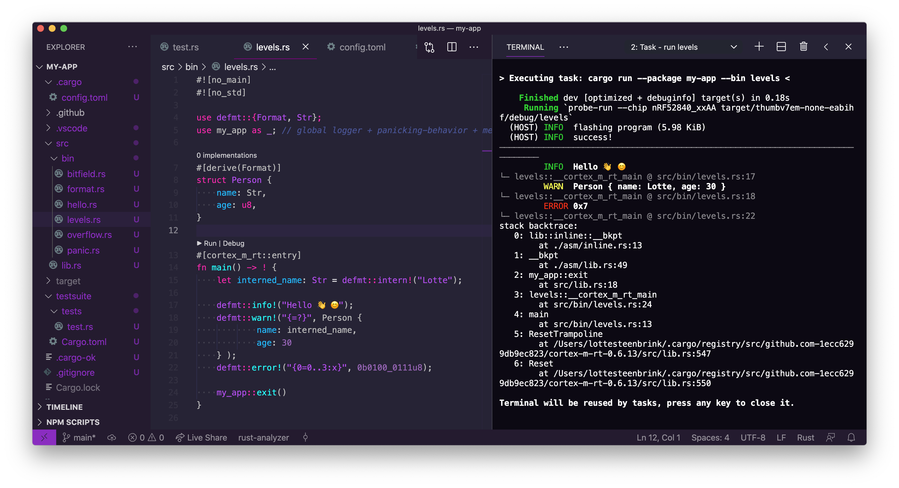
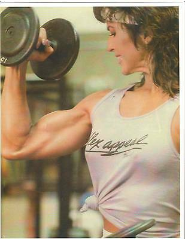

# README

This is my fork of the [Synthwave x Fluoromachine](https://marketplace.visualstudio.com/items?itemName=webrender.synthwave-x-fluoromachine) theme, tweaked for higher contrast and screen share legibility.

I'm mainly using it for Rust and C and have designed it for personal use, but am happy to hear about any feedback!

## that's... an odd name for a theme

It's a reference to a exercise book & apparel line by 80s bodybuilder [Rachel McLish](https://de.wikipedia.org/wiki/Rachel_McLish).

### For more information
* [Visual Studio Code's Markdown Support](http://code.visualstudio.com/docs/languages/markdown)
* [Markdown Syntax Reference](https://help.github.com/articles/markdown-basics/)

**Enjoy!**
